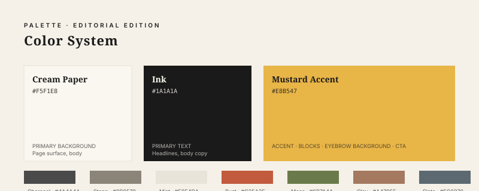
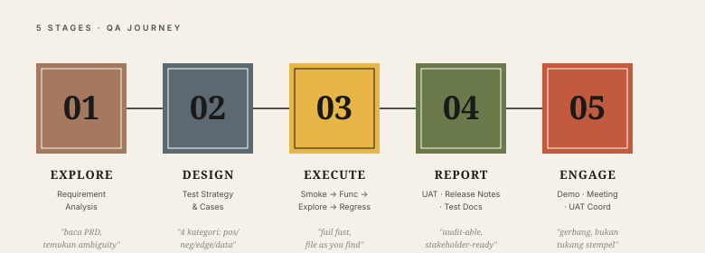
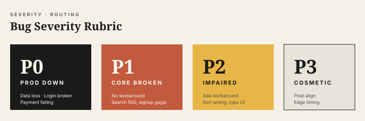

# Journey QA Thomas — Brand Guide v2 (Editorial Edition)

**Versi**: 2.0 · **Tanggal**: 2026-05-22 · **Pemilik**: QA Thomas

Brand guide ini menggantikan versi 1.0 (pink/cyan/yellow tech-energetic). Versi 2.0 mengambil arah **editorial magazine** yang lebih refined, calm-confident, dengan palette earthy dan typography serif. Konten chapter, struktur folder, dan pipeline kode tetap — hanya visual layer yang diganti.

---

## 1. Brand Personality

> **"Quality gate yang refined, sabar membaca, dan berbicara dengan otoritas tenang."**

| Sifat | Iya | Bukan |
|---|---|---|
| **Tone visual** | Editorial magazine, premium-calm | Tech-energetic, loud |
| **Komposisi** | Lapang, asimetris-seimbang, banyak ruang putih | Padat, banyak elemen, gradient ramai |
| **Palette** | Cream + ink + mustard accent, support earthy | Pink/cyan/yellow electric |
| **Typography** | Serif display + sans body | Sans-serif heavy untuk semua |
| **Mood** | Outdoor explore, jurnal perjalanan, refined craft | Startup pitch, viral tech meme |
| **Bahasa** | Indonesia (tubuh) + istilah teknis Inggris | Inggris penuh |
| **Sudut pandang** | "Anda" (formal-friendly) | "Kamu" (informal) |

---

## 2. Logo


**Mark**: kotak mustard solid dengan checkmark hitam — formal seperti badge atau stempel editorial. Ada accent square hitam kecil di pojok kiri-atas sebagai detail editorial.

**Wordmark**:
- Eyebrow `QUALITY · GATE · GROWTH` — Inter 9pt semibold, letter-spacing 3.5px
- Baris 1: `JOURNEY QA` — Playfair Display 30pt ExtraBold, ink
- Baris 2: `thomas` — Playfair Display 22pt Italic Medium, charcoal

**Clear space**: minimum padding = sisi kotak logo (64px).

**Minimum size**:
- Digital: 100px lebar
- Print: 30mm lebar

**Jangan**:
- Memutar logo
- Mengubah warna mark (mustard + hitam tetap)
- Memberi shadow/gradient/bevel
- Menempatkan di background warna ramai (palette lama pink/cyan)

---

## 3. Color Palette



### Primary (3 warna saja — editorial restraint)

| Token | Hex | Pakai untuk |
|---|---|---|
| `--brand-cream` | `#F5F1E8` | Background utama (page, paper) |
| `--brand-ink` | `#1A1A1A` | Body text, heading, logo mark |
| `--brand-mustard` | `#E8B547` | Accent — eyebrow background, block, CTA, highlight |

### Support neutrals (sparing — tidak mendominasi)

| Token | Hex | Pakai untuk |
|---|---|---|
| `--brand-charcoal` | `#4A4A4A` | Secondary text, caption |
| `--brand-stone` | `#8B8579` | Tertiary, divider, italic mantra |
| `--brand-mist` | `#E8E4DA` | Subtle background variant, P3 severity |
| `--brand-cream-soft` | `#FAF7F0` | Lighter surface (card on cream) |
| `--brand-paper` | `#FFFFFF` | High-contrast clean white |

### Earth accents (untuk stage colors & severity, hemat)

| Token | Hex | Pakai untuk |
|---|---|---|
| `--brand-clay` | `#A4795F` | Stage 1: Requirement Analysis |
| `--brand-slate` | `#5C6970` | Stage 2: Test Design |
| `--brand-moss` | `#6B7A4A` | Stage 4: Reporting & Docs |
| `--brand-rust` | `#C25A3E` | Stage 5: Stakeholder; Severity P1 |

### Aturan kombinasi
- **Default page**: Cream bg + Ink text + Mustard accent block.
- **Hero / hook**: Ink bg + Cream text + Mustard accent line.
- **Highlight pull-quote**: Mustard bg + Ink text.
- **Hindari**: Mustard on Cream untuk body (kontras rendah); semua earth accent bersamaan (terlalu ramai).

### Aturan distribusi 60-30-10
- **60% Cream** (background, ruang putih)
- **30% Ink** (text, logo)
- **10% Mustard** (accent block, eyebrow, CTA)

---

## 4. Typography

### Font Stack

| Peran | Font | Weight | Use case |
|---|---|---|---|
| **Display** | Playfair Display | 800 (ExtraBold) | Hero, H1, headlines |
| **Display Italic** | Playfair Display | 500 Italic | Subhead, mantra, tagline pull |
| **Body** | Inter | 400 / 500 | Paragraf, list, caption |
| **Eyebrow** | Inter | 600 | Eyebrow UPPERCASE, letter-spacing 0.18em |
| **Mono** | JetBrains Mono | 500 | Code, template |

**Fallback chain**:
```
Display: 'Playfair Display', 'Lora', 'Georgia', 'Cambria', serif
Body:    'Inter', 'Segoe UI', 'Helvetica Neue', sans-serif
Mono:    'JetBrains Mono', 'Consolas', 'Courier New', monospace
```

### Type Scale (PDF book)

```
Hero      52pt / 1.05  ExtraBold serif      Cover, chapter opener
H1        30pt / 1.15  ExtraBold serif      Chapter title
H2        20pt / 1.3   Bold serif           Section
H3        14pt / 1.4   Bold sans            Subsection
Eyebrow   10pt / 1.4   Semibold sans CAPS   Section eyebrow (above title)
Body      11pt / 1.6   Regular sans         Paragraph
Mantra    12pt / 1.4   Italic serif         Pull-quote, mantra
Caption   9pt  / 1.4   Medium sans          Image caption, footer
```

### Aturan
- **Title case** untuk H1 yang panjang (lebih readable di serif). UPPERCASE untuk eyebrow only.
- **Letter-spacing 0.18em** untuk eyebrow — beri ruang nafas.
- **Maksimal 65 karakter per baris** untuk body (editorial standard).
- Pakai `font-style: italic` untuk emphasis ringan, bukan bold (lebih editorial).
- Hindari `text-align: justify` — keep left-aligned, biarkan ragged edge.

---

## 5. 5 Stages of QA Journey (Editorial Re-palette)



Stage colors di-tone-down ke earth palette agar selaras editorial:

| # | Stage | Token | Mantra |
|---|---|---|---|
| 01 | **EXPLORE** — Requirement Analysis | Clay `#A4795F` | "Baca PRD, temukan ambiguity" |
| 02 | **DESIGN** — Test Strategy & Cases | Slate `#5C6970` | "4 kategori: positive/negative/edge/data" |
| 03 | **EXECUTE** — Smoke → Functional → Exploratory → Regression | **Mustard `#E8B547`** (hero) | "Fail fast, file as you find" |
| 04 | **REPORT** — UAT, Release Notes, Docs | Moss `#6B7A4A` | "Audit-able, stakeholder-ready" |
| 05 | **ENGAGE** — Demo, Meeting, UAT Coord | Rust `#C25A3E` | "Gerbang, bukan tukang stempel" |

Mustard sengaja dipakai untuk Stage 3 (Execute) karena itu fase paling aktif — mustard membawa energi tanpa kehilangan editorial mood.

---

## 6. Severity Rubric (Visual)



P0 sekarang **ink hitam solid** (paling serius secara visual = paling gelap). P1 rust (urgensi tinggi). P2 mustard (warning ada workaround). P3 mist dengan border (cosmetic, hampir invisible).

| Severity | Color | Routing |
|---|---|---|
| **P0** | Ink `#1A1A1A` | Notion + `#incidents` + DM Tech Lead |
| **P1** | Rust `#C25A3E` | Notion + `#incidents` + DM Tech Lead |
| **P2** | Mustard `#E8B547` | Notion + `#qa` |
| **P3** | Mist `#E8E4DA` (border) | Notion only |

---

## 7. Layout Motifs (Editorial Magazine)

Karakter visual yang membuat brand ini "editorial":

### a) Mustard block-of-color
Persegi mustard solid dipakai sebagai:
- Pembungkus eyebrow ("TIME TO EXPLORE" style)
- Highlight di sudut komposisi
- Frame foto/illustration
- Background pull-quote

Selalu **solid color, sharp edge** — bukan gradient, bukan rounded radius besar.

### b) Asymmetric geometric frame
Foto/illustration utama ditempatkan dengan **frame berupa overlap shapes**:
- Persegi cream/paper di balik foto, offset diagonal
- Sebuah block mustard kecil di salah satu pojok foto
- Garis tipis ink (1px) sebagai aksen pinggir

### c) Topographic contour line texture
Sebagai pattern background subtle:
- Garis kontur peta gunung/tanah, opacity ~6%
- Hanya di area background, jangan di area teks
- Mendukung mood "explore / journey"

### d) Tagline architecture
Pola headline editorial khas:
```
[Mustard block: EYEBROW]
HEADLINE BESAR SERIF
Body text kecil, 2-3 baris,
charcoal color, max 65 char.
```

Eyebrow selalu di-bungkus block mustard atau punya background mustard subtle.

### e) Bottom anchor
Bagian bawah komposisi selalu punya:
- Row icon social media (5-6 icon kecil, ink)
- URL website / handle (lowercase sans-serif kecil)
- Atau: logo mark + tagline kecil

Memberi rasa "complete poster", bukan "potongan random".

---

## 8. Social Media Templates (Spec v2)

### Instagram square (1080×1080)

```
┌────────────────────────────────────────┐
│  [mustard block 80px]                  │
│  [exploreqa logo: mustard kotak +     │
│   serif wordmark, top-left]            │
│                                        │
│  TIME TO                ┌──────────┐  │
│  [mustard tab]          │          │  │
│                         │ Foto /   │  │
│  EXPLORE                │ illust   │  │
│  HEADLINE SERIF         │ asimetris│  │
│  Playfair 60pt          │ frame    │  │
│                         └──────────┘  │
│  Body text 11pt charcoal,              │
│  3-4 baris max.                        │
│                                        │
│  [ⓕ ⓘ ⓧ ⓨ ⓛ]   www.journey-qa.id    │
└────────────────────────────────────────┘
```

### Twitter / X header (1500×500)
- Background cream dengan topographic contour subtle
- Logo + eyebrow di kiri
- Mustard block accent di tengah dengan headline serif besar
- Tagline kecil bawah-kanan

### LinkedIn carousel (1080×1350)
- Slide 1 = hero (cream bg, mustard block eyebrow, headline serif)
- Slide 2-7 = poin (cream bg, eyebrow + body, salah satu pojok punya mustard block)
- Slide terakhir = CTA (mustard bg full, ink text serif besar)

### Story / Reel cover (1080×1920)
- Top: logo center 120px
- Middle: foto/illust dengan frame asimetris + mustard accent
- Bottom third: headline serif + body kecil

---

## 9. Voice & Copy Rules

### Hook starter (do)
- "Saya pernah ketemu seorang programmer yang bilang..." (narrative-first, editorial)
- "Industri sudah lama punya angka klasik..." (data-first)
- "Anti-pattern QA paling sering..." (problem-first)

### Hook starter (don't)
- "Hai semua!" / "Halo teman-teman!" — motivational fluff
- "Tahukah Anda?" — klise
- "Tips terbaik tentang QA" — generic

### CTA standar
- "DM 'BOOK' untuk early-access PDF"
- "Save post ini, share ke tim QA-mu"
- "Komentar di bawah pengalaman Anda dengan ___"

### Pantangan
- Kata "amazing", "fantastic", "luar biasa" — vague
- Emoji berlebih (max 1 per paragraf body; 2-3 di IG/FB)
- ALL CAPS lebih dari 4 kata berturut
- Multiple exclamation marks `!!`

---

## 10. File & Asset Naming Convention

```
brand/
├── tokens.css                  ← CSS variables (v2 palette)
├── brand-guide.md              ← dokumen ini
├── prompts-gemini-banana-pro.md ← prompt image gen (v2 palette)
└── assets/
    ├── logo.svg                ← logo lengkap (mustard mark + serif wordmark)
    ├── stage-badges.svg        ← 5 stage editorial
    ├── color-palette.svg       ← palette v2 reference
    └── severity-rubric.svg     ← P0 ink → P1 rust → P2 mustard → P3 mist
```

Penamaan file: lowercase, hyphen-separated.

---

## 11. Checklist Pakai Brand v2

Sebelum publish konten apapun:

- [ ] Logo v2 dipakai (mustard square + serif "JOURNEY QA / thomas")
- [ ] Palette mengikuti 60-30-10 (cream/ink/mustard)
- [ ] Heading pakai Playfair Display ExtraBold; eyebrow pakai Inter Semibold tracking 0.18em
- [ ] Body Inter, max 65 char/baris
- [ ] Mustard block dipakai untuk eyebrow/highlight (bukan gradient)
- [ ] Stage badge (kalau ada) pakai earth palette baru (Clay/Slate/Mustard/Moss/Rust)
- [ ] Severity P0 = ink, P1 = rust, P2 = mustard, P3 = mist
- [ ] Tone: refined, narrative-first, "Anda"
- [ ] Bottom anchor: social row + URL (untuk template social)
- [ ] Caption hashtag mengikuti GEO guide (`brand/prompts-gemini-banana-pro.md` untuk visual)

---

## 12. Apa yang Berubah dari v1

| Aspek | v1 (deprecated) | v2 (editorial) |
|---|---|---|
| Palette | Pink #E91E63 + Cyan #26C6DA + Yellow #FFD600 | Cream #F5F1E8 + Ink #1A1A1A + Mustard #E8B547 |
| Typography | Montserrat ExtraBold sans | Playfair Display ExtraBold serif |
| Mood | Tech-energetic playful | Editorial magazine refined |
| Stage colors | Saturated rainbow | Earth (Clay/Slate/Mustard/Moss/Rust) |
| Severity | Red/Orange/Yellow/Cyan | Ink/Rust/Mustard/Mist |
| PDF stylesheet | Pink border + cyan H2 | Cream bg + serif H1 + mustard accent |
| Layout motif | Geometric badges, arrows, energetic | Block-of-color, asymmetric frame, contour bg |

Untuk reapply ke konten yang sudah ada:
1. Recompile PDF book → otomatis pakai stylesheet v2 (`utils/book_compiler.py` sudah update).
2. Re-generate atau regenerate manual image untuk social/cover dengan prompt v2 (`brand/prompts-gemini-banana-pro.md` baru).
3. Content text (chapter MD, social posts JSON) — tidak perlu diubah, hanya visual layer.
